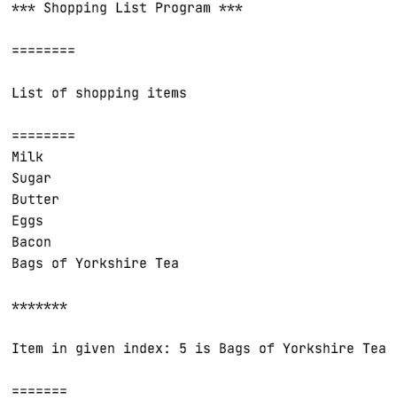
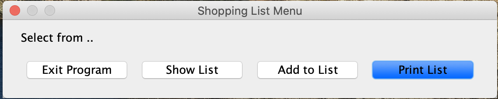
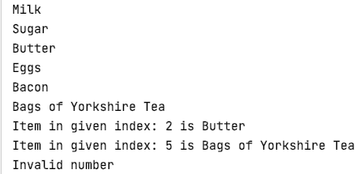

# Shopping List Program

This is a Java application, designed to take shopping items as input
and display a shopping list as output. Included in the repository is a test class
and a Java Swing GUI class. 

## Installation: 

Download or clone the repository on your local machine.

```sh
$ git clone https://github.com/AAdewunmi/Shopping_List_Program.git
$ cd Shopping_List_Program
```
## Console output 

### Test class output



### Shopping List Program GUI 



### Shopping List Program Instructions:

1. Add items to list [Add To List]
1. Print to console all items in list [Print List]
1. Return a specific item based on its index [Show List]
   1. If you enter an index out of range, program returns an error message "Invalid Number"
1. Exit shopping list program [Exit Program]

### Shopping List Program output



